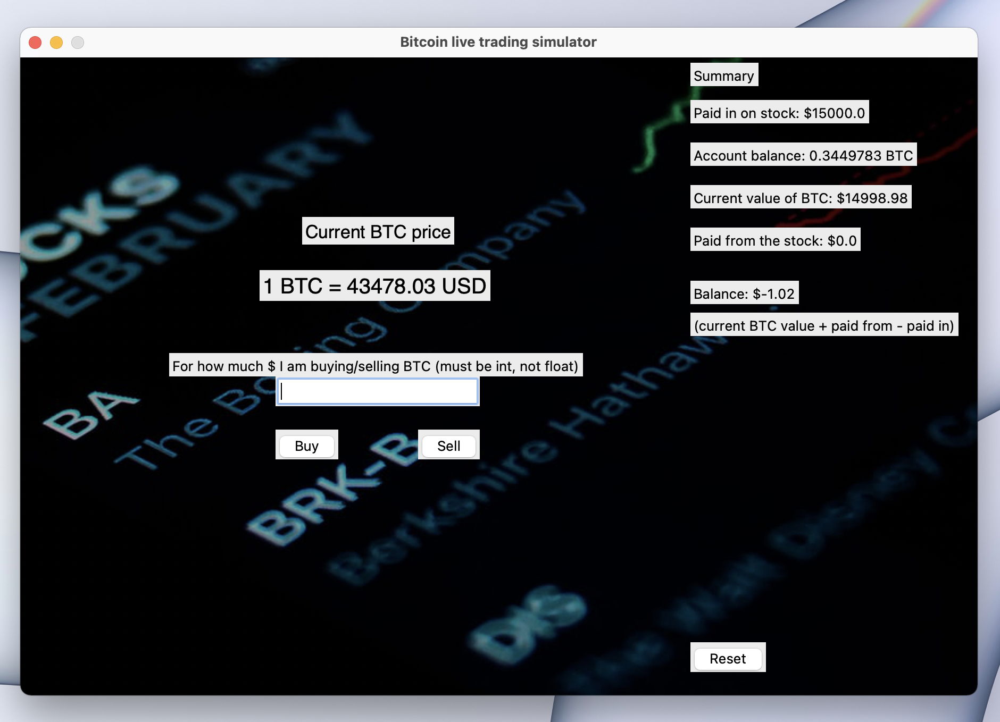

# Bitcoin live trading simulator made in Python-tkinter with GUI

## Table of Contents
* [General Info](#general-information)
* [Technologies Used](#technologies-used)
* [Features](#features)
* [Screenshots](#screenshots)
* [Setup](#setup)
* [Project Status](#project-status)
* [Room for Improvement](#room-for-improvement)
* [Contact](#contact)

## General Information
This simulator lets you trade Bitcoin with its real time value without using real money. You can use it to train and try yourself as a day trader. You can reset your stats any time with "Reset" button.

## Technologies Used
- Python 3.x
- Tkinter Python built-in module
- Cryptocompare Python module

## Features
- You can buy or sell BTC when you think it is a good time to do so and wait for results shown in "Balance" label.

## Screenshots

## Setup
Python 3.x installed and:
`pip3 install cryptocompare`

## Project Status
Project is done/in progress because there is space for development.

## Room for Improvement

Room for improvement:
- Adding more cryptocurrencies to choose
- Adding more curriencies to trade with to choose

## Contact
Mail: michvlbbb@gmail.com
